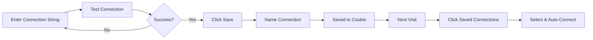

# Connection Storage - Quick Start Guide

## 🚀 Get Started in 3 Steps

### Step 1: Install & Configure (2 minutes)

```bash
# Install the session library
npm install iron-session

# Generate a secure secret
openssl rand -base64 32

# Add to .env.local
echo "SESSION_SECRET=<your-generated-secret>" >> .env.local

# Start the app
npm run dev
```

### Step 2: Save Your First Connection (30 seconds)

1. Open the app at `http://localhost:3000`
2. Enter your MongoDB connection string
3. Click "Test Connection"
4. Click the **Save** icon button (appears after successful connection)
5. Enter a name like "My Production DB"
6. Click "Save"

### Step 3: Use Saved Connections (10 seconds)

1. Click "Saved Connections" button
2. Click on your saved connection
3. Auto-connects - ready to build pipelines!

---

## 🎯 Key Features

| Feature | Description |
|---------|-------------|
| **Secure Storage** | AES-256-GCM encryption |
| **Quick Access** | One-click reconnection |
| **Multiple Connections** | Save all your clusters |
| **Auto-Connect** | Loads connection string & database |
| **Delete Anytime** | Full control over saved data |

---

## 🔒 Security Highlights

- ✅ **Encrypted cookies** (not plain text)
- ✅ **HTTP-only** (JavaScript can't access)
- ✅ **30-day expiration** (auto cleanup)
- ✅ **No server storage** (your device only)
- ✅ **HTTPS in production** (secure transmission)

---

## 📝 Quick Reference

### Save Connection
```
1. Test connection successfully
2. Click Save icon (💾)
3. Enter memorable name
4. Confirm
```

### Load Connection
```
1. Click "Saved Connections"
2. Select from list
3. Auto-connects
```

### Delete Connection
```
1. Open "Saved Connections"
2. Click trash icon (🗑️)
3. Connection removed
```

---

## ⚙️ Environment Setup

### Minimum Required
```env
SESSION_SECRET=your-secure-random-string-min-32-chars
```

### Full Configuration
```env
# MongoDB
MONGODB_URI=mongodb+srv://...
MONGODB_DATABASE=mydb

# Session (REQUIRED for security)
SESSION_SECRET=<generate with: openssl rand -base64 32>

# Optional
OPENAI_API_KEY=sk-...
```

---

## 🐛 Common Issues

| Problem | Solution |
|---------|----------|
| "Failed to save" | Check `SESSION_SECRET` is set |
| Connections disappear | Check not in incognito mode |
| Can't load connection | Verify cookies enabled |
| Error after restart | Cookie may have expired (30 days) |

---

## 💡 Pro Tips

1. **Name Conventions**: Use descriptive names like "Prod-US-East", "Dev-Local"
2. **Security**: Don't save connections on shared/public computers
3. **Backup**: Keep connection strings in password manager as backup
4. **Testing**: Save test/dev connections for quick switching
5. **Cleanup**: Delete old connections you no longer use

---

## 📚 More Information

- **Full Documentation**: See [CONNECTIONS_STORAGE.md](CONNECTIONS_STORAGE.md)
- **Implementation Details**: See [IMPLEMENTATION_SUMMARY.md](IMPLEMENTATION_SUMMARY.md)
- **Security Guide**: Review encryption standards in main docs

---

## 🎓 Example Workflow



---

**Need Help?** Check the troubleshooting section in [CONNECTIONS_STORAGE.md](CONNECTIONS_STORAGE.md)

**Ready to build?** Start saving your connections now! 🚀
